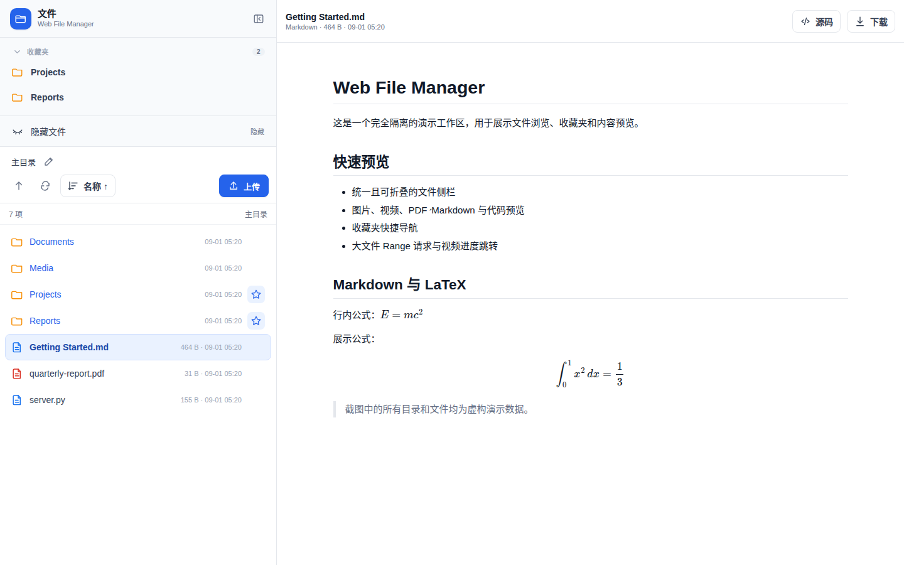

# Web File Manager

English | [简体中文](README.zh-CN.md)

A lightweight single-user web file browser. The interface is rooted at the running user’s `$HOME`, with support for file previews, favorites, uploads, and downloads.

## Interface



## Features

- Cloud Light theme: favorites and the file list are on the left, with the preview area on the right.
- The file sidebar width can be adjusted, and the entire sidebar can be collapsed using the button or the `B` key.
- Favorites are collapsed by default; the star on a directory row adds or removes it from favorites.
- The hidden-file toggle uses closed-eye and open-eye icons to indicate its current state.
- The path bar accepts absolute paths within `$HOME` and supports `/?open=<path>` deep links.
- Images support previews and left/right navigation within the same directory.
- Videos use the browser’s native player, muted by default, with progress seeking and 5-second backward/forward jumps using `←` / `→`. Supported codecs depend on the browser.
- PDFs open in the local PDF.js viewer.
- Markdown supports syntax highlighting and `$...$`, `$$...$$`, `\(...\)`, and `\[...\]` LaTeX formulas.
- HTML files support webpage preview and source switching; text and code files support syntax highlighting.
- Drag-and-drop uploads, multiple-file uploads, and file downloads are supported.
- On narrow screens, the file list and preview area are shown separately, and the preview page provides a button to return to the list.

## Running

Requires Python 3.8+ and Tornado 6.x.

```bash
WEBFM_AUTH="<user>:<strong-password>" python web_file_manager.py
```

By default, it listens on `0.0.0.0:7701`.

| Variable | Default | Description |
|---|---|---|
| `WEBFM_AUTH` | Required | HTTP Basic credentials in `user:pass` format |
| `WEBFM_PORT` | `7701` | Listening port |
| `WEBFM_CONFIG_DIR` | `~/.config/web-file-manager` | Configuration directory |
| `WEBFM_FAVORITES_FILE` | `$WEBFM_CONFIG_DIR/favorites.json` | Favorites data file |

## systemd User Service

`~/.config/systemd/user/webfilemanager.service`:

```ini
[Unit]
Description=Web File Manager
After=network.target

[Service]
Type=simple
Environment="WEBFM_AUTH=<user>:<strong-password>"
Environment=WEBFM_PORT=7701
WorkingDirectory=%h
ExecStart=/path/to/python /path/to/web-file-manager/web_file_manager.py
Restart=on-failure
RestartSec=3

[Install]
WantedBy=default.target
```

```bash
systemctl --user daemon-reload
systemctl --user enable --now webfilemanager.service
```

## Operating Boundaries

- The service refuses to start when `WEBFM_AUTH` is not set.
- The interface can access only content within `$HOME`; out-of-bounds paths and symlinks pointing outside `$HOME` return 403.
- HTML previews treat files as trusted personal documents and do not use an iframe sandbox.
- The service is suitable for a trusted LAN or Tailscale network and should not be exposed directly to the public internet.
